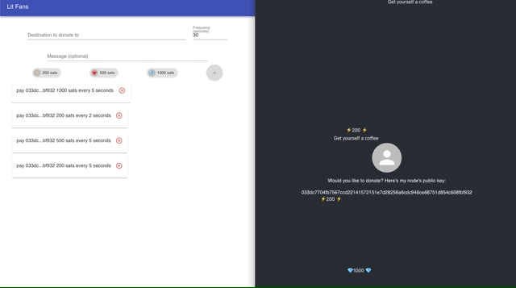
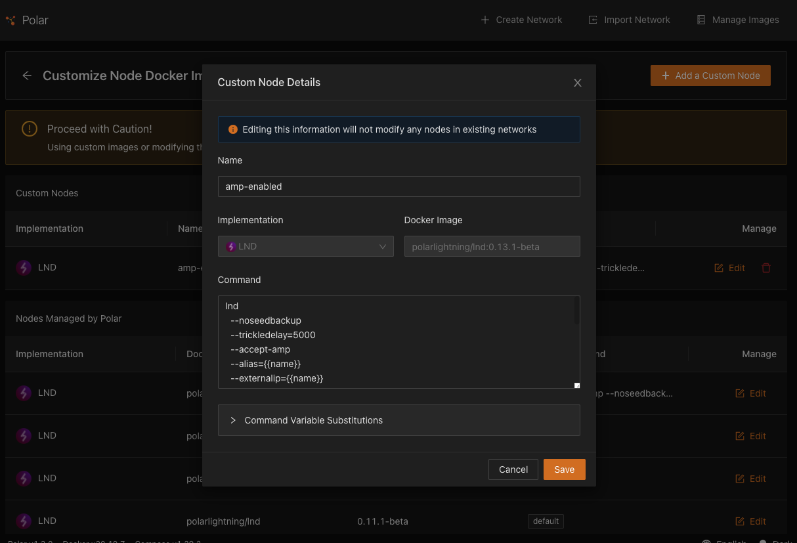
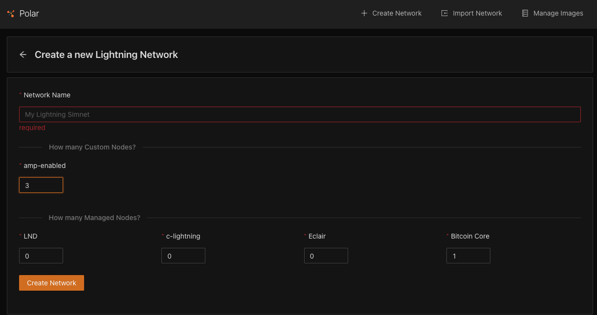
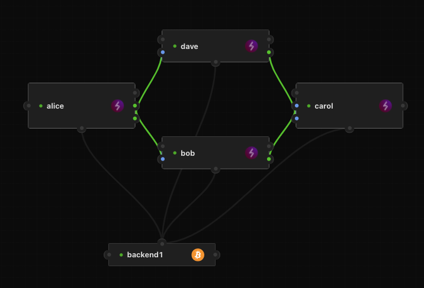
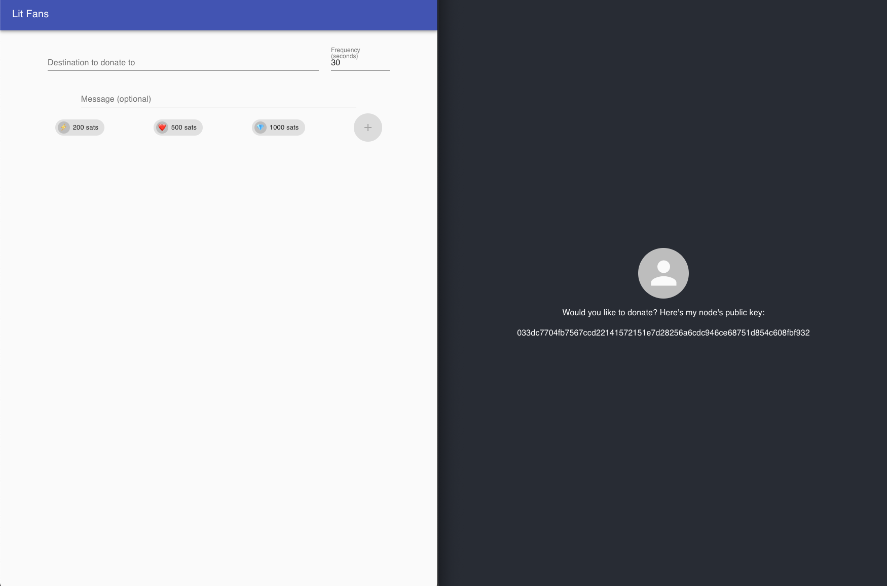
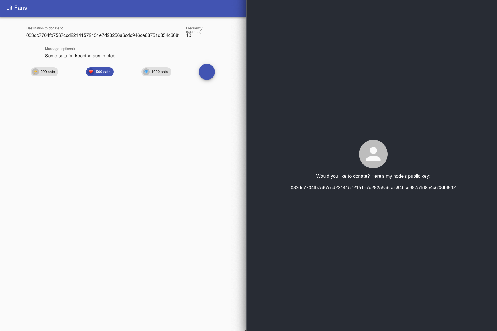
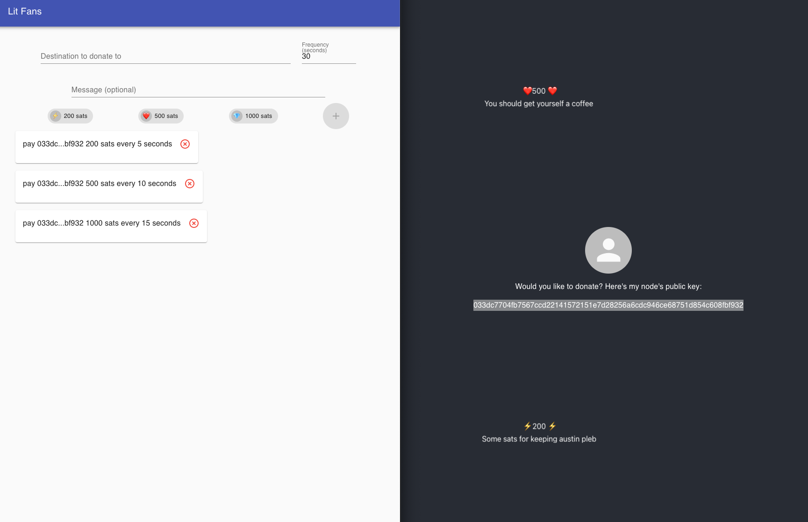

# Lit Subscriptions

This was a hackathon submission for [pleb.fi/austin](https://pleb.fi/austin), 2021.

The hackathon was 24 hours, so it's pretty simple, but it demonstrates using the new AMP feature
being developed in lnd by the [Lightning Labs](https://lightning.engineering). There are two
apps in this repo, one is for setting up recurring donations (lit-fans) and the other is for advertising
a public key to donate to and visualize incoming payments (lit-donations).



## Requirements

- [Docker](https://docs.docker.com/get-docker/)
- [Polar](https://lightningpolar.com/)
- [lncli](https://dev.lightning.community/guides/installation/) (version >=0.13.99-beta)
- Node >12

## Setup

This demo requires the latest versions of lnd version 13, which can be amp enabled.
This is relatively easy to get setup in a test environment on regtest with Polar.

Learn more about [AMP](https://docs.lightning.engineering/lightning-network-tools/lnd/amp)
on the lightning labs documentation website.

To start you'll want to first clone this directory
to your local machine. All of the below setup steps
assume everything is on the same host.

### Test network in Polar

To get AMP-enabled nodes in Polar:

1. click "Manage Images" in the top right of the app
2. "Add a custom node"
3. Set docker image to `polarlightning/lnd:0.13.1-beta` or later
4. Update the lnd startup command to include the option `--accept-amp` (See [Getting your node ready for amp](https://docs.lightning.engineering/lightning-network-tools/lnd/amp#docs-internal-guid-0aff8c2e-7fff-3644-f0f2-cf0efff90d43)) for more

Now you can create your network with polar. Just make sure
to create it with at least a couple of your custom nodes
(in the image below I've named these images "amp-enabled")




Once the network is setup, you'll want to mine some
blocks, fund your nodes, and open channels. You can
test out the features of AMP (Atomic Multipath Payments)
by getting creative with your connecting paths and available
balances.



### Set lnd connection details

Decide which nodes you want to use for the fan and for
the donation node.

For our example, Alice will be the fan and Carol will be
the one asking for donations.

To get the details, click on each node, then click on "Connect". What we care about are the TLS Cert, Admin Macaroon,
and "GRPC Host".

In your `lit-fans` directory, create a file `.env` and fill out
the connection details collected above:

```
LND_TLS_CERT=[Absolute path to file or Hex value]
LND_MACAROON=[Absolute path to file or hex value]
LND_SOCKET=[GRPC Host value]
```

Now do the same thing for Carol in the lit-donations directory.

### Run the apps

You'll want two different terminal sessions. But first
we'll make sure to install the dependencies.

In the root directory run:

```shell
$ ./install.sh
```

This will install dependencies for both apps.

Next, run `./run.sh` and choose which project you want to
run in the current session (it doesn't matter which you choose first):

```shell
$ ./run.sh
Which project (client and server) would you like to run?
1) Fan's site
2) Donations page
3) Cancel
#?
```

This will run the server which connects to the polar node
you set the credentials for, build the front end, and serve
the webapp.

Run the same command `./run.sh` in another terminal session
to run the other application.

The fan website runs on localhost on port `5000` by default, and the donations
site runs on port `3000`.

## How it works

With AMP, you can push payments to a target node without
its first providing a fresh invoice for you, similar to
the user flow in on-chain bitcoin where you can send to a static address.
You can also send messages in the optional TLV (type length value) field.



When you subscribe to a public key, you are comitting to sending that node
a certain number sats, an emoji, and an optional message over a recurring
cycle of time. The message and emoji are sent directly to the receiving node
over the Lightning Network itself every time the event is triggered.



You can also track your existing subscriptions and cancel them from the fans site.



The donations site will show all recent activity that comes through the node
including the emojis and messages that come through in the TLVs, as the node
receives them.


## How to improve

Here are some things that would be nice to build out and improve on in future iterations:

#### Maintaining state

The only state that is maintained are the node credentials. All subscription information
is saved in memory and the payments are activated with a simple `setInterval` in the browser
and canceled with a `clearInterval`. It would be nice if this were maintained in a database
and the payments activated via some script scheduler.

#### Payment Addresses and AMP Invoices

One feature that isn't quite ready in lnd but should be coming in an upcoming is support
for payment addresses as the payment target rather than public keys. This would allow
receivers of subscription payments to not have to reveal their public key. It may also be possible
to encode other relevant information generated by the receiver rather than the donor, such as
the frequency of payments expected. This would be useful in contexts such as subscriptions
as opposed to simply voluntary donations where payments are associated with expected frequencies.
